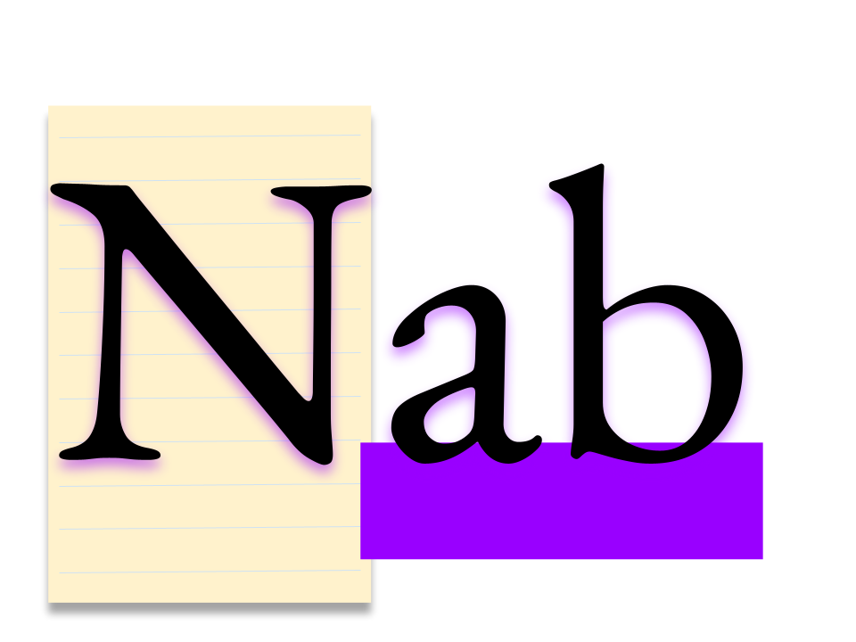
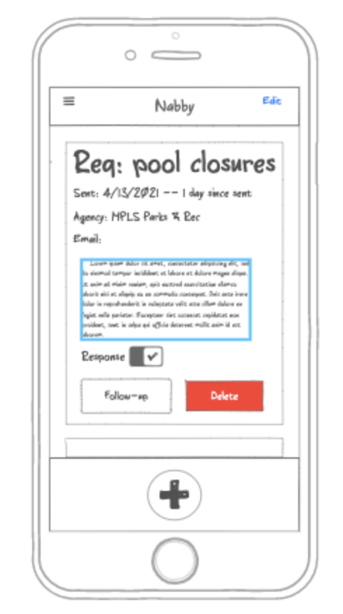

# Nab

## Description

Requesting open records can be a time-intensive, complicated task when you’re working as a journalist, but it’s also central to the job. Nab automates the hard stuff by helping reporters format record requests and track progress.

Nab’s Home screen shows a record of the user’s past open records request in chronological order. A user can quickly make a new request, with help from Nab’s library of formatted letters tailored to state’s varying open records laws.

## Tech

 React, Redux, Express, Passport, and PostgreSQL, MaterialUI (a full list of dependencies can be found in `package.json`).

## See it

Early concept deployed on Heroku: [https://floating-fjord-59845.herokuapp.com/#/home](Nab)

## Wireframes

### Nab home screen

### Nab create request screen

## To-do

[x] Setup
  [x] watch boilerplate vids
  [x] setup/review components
    - Registration 
    - Home
    - RequestList
    - RequestItem
    - Create
    - Confirmation
  [x] setup Routes
    - Home screen should replace landing screen
    - Do I want to keep the nav bar as is? New style? -- WILL NEED TO CHANGE FOR MOBILE
    - Setup links and useHistory for Nab's workflow (register/login >>> Home >>> CreateRequest >>> Confirmation >>> Home)
[x] Rework Nav
  [x] watch Youtube vid on MaterialUI "drawers"
  [x] replace Nav element with popout
  [x] hamburger menu icon
[x] update register screen - RegisterForm
  [x] update user db to account for first and last name
  [x] add two inputs for first and last name
  [x] add first and last to payload, POST route to make sure it's getting to db
  [x] "join" button
[x] Home pt 1
  [x] build out component
  [x] should replace landing screen
  [x] prep for GET route (SHOULD THIS HAPPEN ON REQUESTLIST?)
    - useEffect, dispatch and useSelector 
    - saga
    - db setup - 'request' table and '/api/request' router
  [x] conditional render for no entries -- "make your first request!"
[x] CreateRequest pt 1
  [x] build out component
    - inputs
    - buttons
  [x] dispatch for GET - pre-formatted letter text
  [x] useSelector for letter text
  [x] functions to handle inputs
  [x] function to handle "state" dropdown
  [x] function to link and bring the whole "request" object to "confirmation" screen
  [x] back button-- will become eventually X button in upper right to "close"?
[x] CreateRequest pt 2
  [x] reducer to handle data back from GET route for letters
  [x] saga for GET call from "letter" table
  [x] GET route on server side
[x] Confirmation screen
  [x] useSelector for calling tempRequest from Redux
  [x] build out component
    - "your request" header
    - text box to show completed request
    - "copy" button
    - "home" button
  [x] function for copy button
    - npm install useClippy hook
    - import
    - setup
  [x] function for save button
    [x] dispatch for POST call
    [x] saga for POST call to "request" table
    [x] make request.router.js file
    [x] POST route on server side
[ ] Home pt 2
  [x] finalize GET route from "request" table to component -- WHY AREN'T NEW ENTRIES SHOWING IN STRINGIFY?
  [x] Display info to DOM
  [x] "Create Request" Icon should be a "fixed" component on bottom
  [x] setup "card" components in RequestItem
  [x] Finalize where GET route should go (RequestList or Home?)
  [x] dispatch for Delete btn
  [x] function to handle Response toggle (DELETE)
  [x] dispatch for Response (PUT)
  [ ] SocketIO for instant updating?
[ ] CreateRequest pt 3
  [ ] revamp UI of component (breadcrumbs?)
[ ] Bugs
  [x] Text not resetting on "letters" textbox (dropdown handler? POST route?)
  [ ] Connect StateDropdown to db (Saga/GET to "letters")
  [x] Add "user_id" to POST route (so results can be specific)
  [x] Add "user_id" to initial GET route (so results are user specific)
  [x] figure out theme "mixins" so MUI elements dont cover each other
  [x] Make profile page (about component)
    -useSelector for user
    -DOM elements: Nav, Full name, username
  [x] counter for profile page
    -useSelector for records
    -DOM element: counter
  [ ] Clean up comments/unused code
    [ ] Home
    [ ] RequestList
    [ ] RequestItem
    [ ] CreateRequest
    [ ] ConfirmRequest
    [ ] App.jsx
    [ ] sagas
    [ ] reducers
    [ ] routes
    [ ] server.js
    [ ] LoginPage/Form
    [ ] RegisterPage/Form
    [ ] LandingPage
    [ ] AboutPage
[x] Styling
  [x] Nav bar - drawers/popout menu
  [x] Home - "+" icon for linking to CreateRequest
  [x] RequestItem cards
  [x] RequestList
  [x] CreateRequest - buttons, inputs, 'X' button to close instead of "back button"
  [x] Confirmation - textbox, buttons
  [x] Registration screen - inputs/buttons
  [x] Research MUI 'Box' elements
  [x] Make logo for Nab

[ ] Stretch goals...